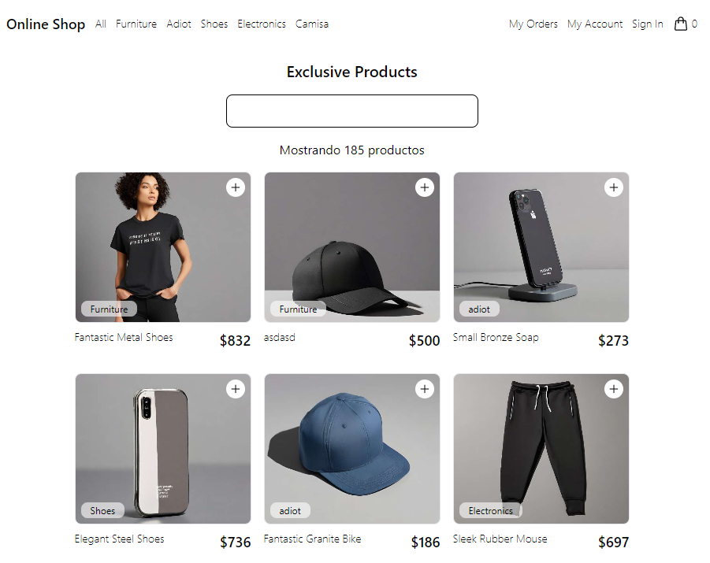
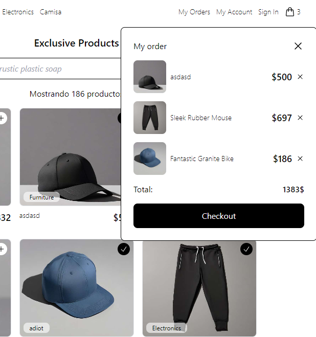

# Tienda en Línea con React

Este repositorio contiene una aplicación web de una tienda en línea desarrollada en React. El propósito de este proyecto es demostrar mis habilidades como desarrollador Frontend y mi capacidad para crear una experiencia de compra en línea atractiva y funcional.

## Características Principales

- Mostrar una lista de productos con detalles como nombre, precio y descripción.
- Filtrar productos por categoría, precio o marca.
- Agregar productos al carrito de compras.
- Ver y ajustar la cantidad de productos en el carrito.
- Realizar el proceso de compra simulada (sin pagos reales).
- Administrar el estado de productos en tiempo real.

## Demo

Puedes ver una demostración en vivo de la aplicación [aquí](https://glowing-souffle-dc41d6.netlify.app/).

## Capturas de Pantalla




## Tecnologías Utilizadas

- React
- JavaScript
- HTML5
- CSS3
- Vite

## Instalación

Sigue estos pasos para ejecutar la aplicación en tu entorno local:

1. Clona este repositorio:

   ```bash
   git clone https://github.com/cesarforall/online-shop.git
   ```

2. Navega al directorio del proyecto:

    ```bash
    cd online-shop
    ```

3. Instala las dependencias:

    ```bash
    npm install
    ```

4. Continúa con 👇

# React + Vite

This template provides a minimal setup to get React working in Vite with HMR and some ESLint rules.

Currently, two official plugins are available:

- [@vitejs/plugin-react](https://github.com/vitejs/vite-plugin-react/blob/main/packages/plugin-react/README.md) uses [Babel](https://babeljs.io/) for Fast Refresh
- [@vitejs/plugin-react-swc](https://github.com/vitejs/vite-plugin-react-swc) uses [SWC](https://swc.rs/) for Fast Refresh
